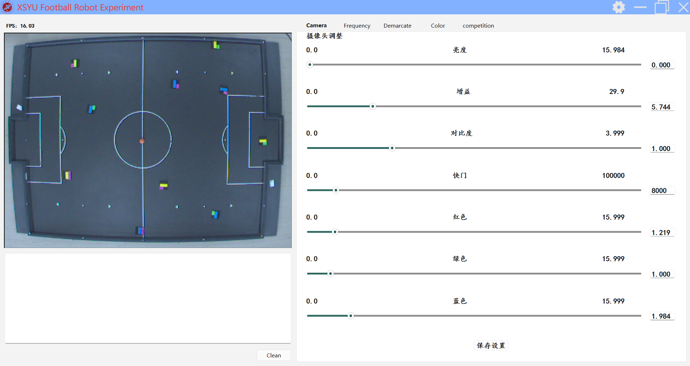
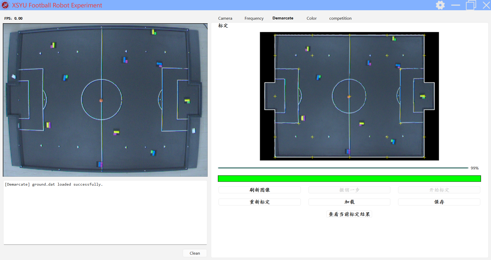
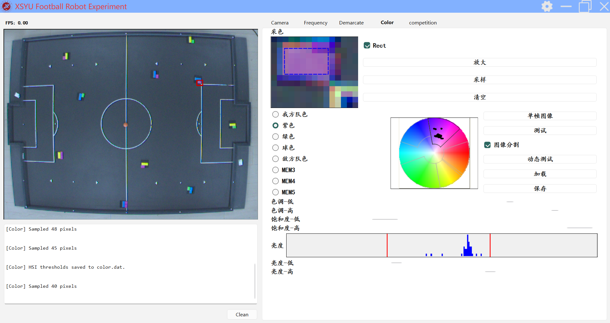
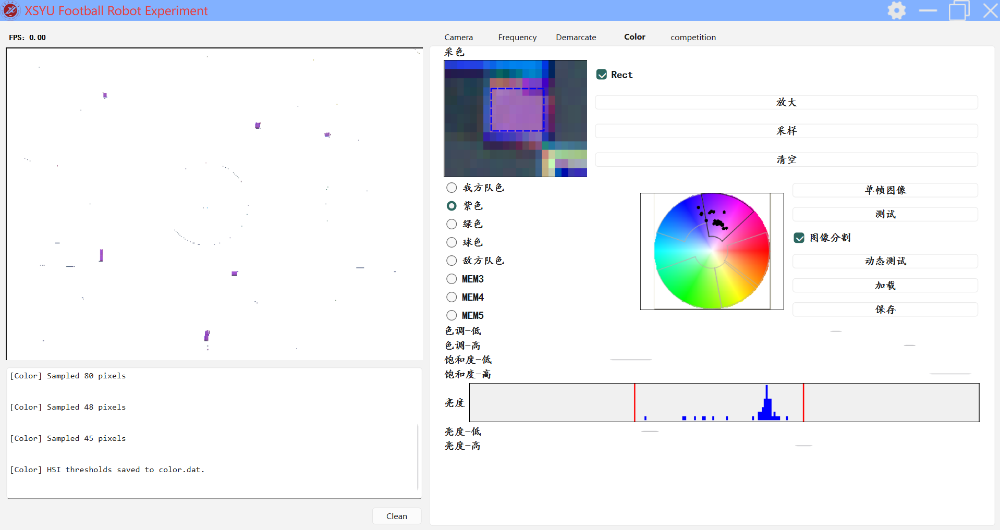
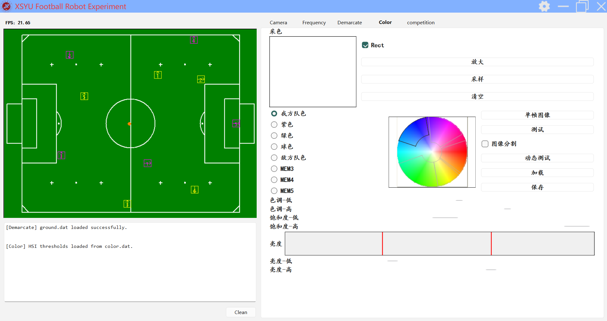

# 机器人足球视觉识别与标定实验平台操作说明

## 一、程序运行

本软件为基于 Qt 框架开发的图形界面（GUI）应用程序，无命令行参数，通过图形界面交互操作。运行前需满足以下条件：

（1）运行环境：Windows 10/11 64 位操作系统，已安装 Basler Pylon 相机 SDK 与 OpenCV 运行库；

（2）硬件连接：已通过 USB 接口连接 Basler USB 工业相机，并确保相机被系统识别；

（3）数据文件：首次运行时无需任何数据文件；标定完成后将在程序所在目录生成 color.dat（颜色阈值）与 ground.dat（场地映射表），resources 目录下需存在 HLUT.dat（色相查找表）与 HSICir.bmp（色环底图）等资源文件。

程序运行可通过以下两种方式启动：

方式一（直接运行）：双击 QtWidgetDesign.exe 启动程序，主窗口将居中显示，启动后自动进入 Camera（相机）标签页并开始抓取相机视频流。

方式二（开发环境运行）：在 Visual Studio 2022 中打开 RobotExperimentPlatform.sln 解决方案，确认 QtWidgetDesign 项目已分配本机 Qt 6.10.1 版本后，按 F5（调试运行）或 Ctrl+F5（开始执行不调试）启动。

程序主界面分为左右两部分：左侧上方为相机显示区（固定 640×512，实时显示相机画面与识别结果，并叠加帧率），左侧下方为调试信息区（显示各模块运行日志）及 Clean 清除按钮；右侧为功能标签页，依次为 Camera（相机参数）、Frequency（频率）、Demarcate（场地标定）、Color（颜色标定）、competition（比赛）。通过点击标签页切换各功能模块。

各标签页功能说明：

Camera：相机参数调节，包含黑电平、增益、Gamma、快门（曝光时间）、红/绿/蓝白平衡七项参数的滑块与输入框，参数实时下发相机生效，点击 Save 保存至 CameraConfig.ini 持久化。

Frequency：通信频率设置与车辆编号配置。

Demarcate：场地标定，采集 25 个控制点进行多项式拟合，建立像素坐标到场地物理坐标的映射。

Color：HSI 颜色标定，对 5 个颜色对象分别标定 H/S/I 阈值。

competition：比赛控制面板。

​													*图1 程序主界面*

## 二、程序结果输出

程序运行过程中与结束后产生以下输出：

1. 标定结果俯视预览

在 Demarcate 标签页完成标定后，可查看俯视预览图：将相机画面按场地映射表重投影为俯视图，叠加场地边界白线与 25 个控制点的理论位置（黄色十字），用于核对标定精度与重投影偏差。

2. 采色结果预览

 在 Color 标签页完成区域采样与阈值调节后，可查看采色结果预览：将采样像素按 RGB→HSI 转换映射到色环上，以黑点标注其色相与饱和度分布，并绘制亮度直方图与 I阈值线，同时以阈值扇形（当前对象叠黑色弧、其余对象灰色弧）直观显示各颜色对象在 HSI 空间中的覆盖范围。点击"测试"可对当前对象的 H/S/I阈值进行单帧匹配验证，在画面上高亮命中像素，用于核对阈值设置的准确性与漏检/误检情况。

2. 标定数据文件与调试信息输出

颜色标定：在 Color 标签页完成各对象 H/S/I 阈值标定后，点击"保存"生成 color.dat 文件（二进制，192 字节，存储 HSIThreshold[8][6] 阈值数组）。下次启动可通过"加载"读回，含旧格式（H 值 0~360）自动升级为新格式（0~3600）的兼容处理。

场地标定：在 Demarcate 标签页完成 25 点多项式拟合后，点击"保存"生成 ground.dat 文件（二进制，约 2.76MB，存储 640×480 像素到场地坐标的映射表 Ground，每项含 x、y 坐标与场内标志）。下次启动可通过"加载"直接复用历史标定。

相机参数：相机参数在程序退出时自动保存至 CameraConfig.ini（文本，7 行 Key=Value），下次启动自动加载。

左侧调试信息区（Consolas 字体）实时输出各模块运行日志，包括相机打开/关闭状态、抓帧超时、标定计算进度、识别目标位置等。点击 Clean 按钮可清空调试信息。

4. 实时识别结果输出

在相机显示区实时显示识别结果：基于已标定的颜色阈值与场地映射，识别己方与对方机器人、足球的位置，在画面上以色块标注，并在比赛态/预备态下叠加绘制机器人外形（黄色描边为我方、品红描边为对方）、足球（橙色圆点）及场地背景。显示区左上角实时显示帧率（FPS）。

​												*图2 场地标定与俯视预览*

​												*图3 采色过程*

​												*图4 采色识别结果*

​												*图5 实时识别结果*

 